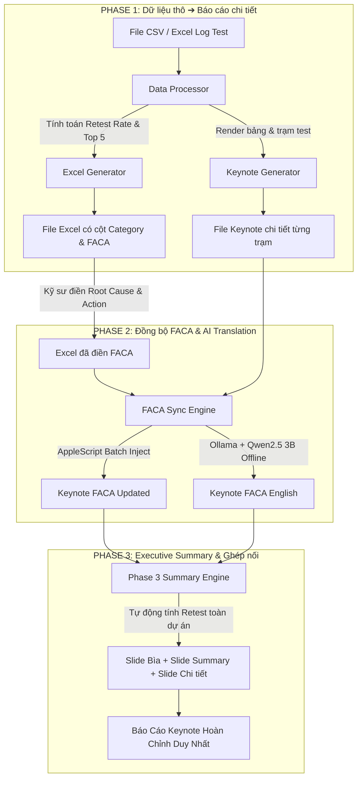

# 0.5%hopeless 🚀
### Apple & OEM Hardware Test Retest Report Automation with Embedded Local AI

<p align="center">
  
</p>

<p align="center">
  <b>Hệ thống tự động hoá báo cáo tỷ lệ Retest, trích xuất Top 5 Failure Issue, đồng bộ FACA và render Keynote/Excel chuẩn công nghiệp nhà máy sản xuất phần cứng (Foxconn / Apple OEM).</b>
</p>

<p align="center">
  
  
  
  
  
</p>

<p align="center">
  👉 <b><a href="HUONG_DAN_SU_DUNG.md">Xem Sổ Tay Hướng Dẫn Sử Dụng Chi Tiết Từ A-Z Tại Đây (HUONG_DAN_SU_DUNG.md)</a></b> 👈
</p>

---

## 📖 Giới thiệu (Overview)

Trong các dây chuyền sản xuất và thử nghiệm phần cứng (NPI / PVT / MP), việc tính toán tỷ lệ retest (Retest Rate) từng trạm test (FATP, ICT, BLE, RF, Sensor, Audio,...) và lập báo cáo hàng ngày thường tốn hàng giờ thao tác thủ công trên bảng tính và bài thuyết trình Keynote.

**0.5%hopeless** được xây dựng nhằm tự động hoá toàn diện quy trình 3 giai đoạn (3-Phase Pipeline):
1. **Phân tích dữ liệu & Báo cáo chi tiết:** Đọc log test CSV/Excel dung lượng lớn, lọc dữ liệu, tính tỷ lệ Retest & Fail, xếp hạng Top 5 Issue cho từng trạm và xuất file Excel + slide Keynote chi tiết theo mẫu chuẩn.
2. **Đồng bộ FACA & Dịch kỹ thuật bằng AI Offline:** Nhận dữ liệu phân tích nguyên nhân lỗi (Root Cause), hành động khắc phục (Corrective Action) từ file Excel, đồng bộ tự động vào các ô tương ứng trên slide Keynote qua AppleScript. Tích hợp sẵn mô hình ngôn ngữ lớn nội bộ (Qwen 2.5 3B) chạy 100% offline bằng Metal GPU, tự động chuyển đổi FACA từ tiếng Việt / tiếng Trung sang tiếng Anh kỹ thuật nhà máy chuẩn format (`RC. CA: ... CP: ...`).
3. **Tổng hợp Executive Summary & Ghép nối Slide:** Tự động quét và tổng hợp tỷ lệ retest toàn dự án, tạo slide Trang bìa (Cover - Mẫu 3) và slide Báo cáo điều hành (Executive Summary - Mẫu 2), sau đó tự động ghép nối hoàn chỉnh thành một tệp Keynote duy nhất sẵn sàng báo cáo ban quản lý.

---

## ⚡ Quy trình xử lý (Pipeline Flow)



---

## ✨ Tính năng nổi bật (Key Features)

### 🔹 Phase 1: Phân tích & Tạo Báo Cáo Ban Đầu
- **Bộ đọc dữ liệu thông minh:** Xử lý linh hoạt các định dạng CSV / Excel từ các hệ thống SFC / PDCA / Tester logs.
- **Tính toán chỉ số chính xác:** Tự động nhận diện tổng sản phẩm thử nghiệm (Input), số lần retest (Retest Count), tỷ lệ retest (Retest Rate %), và lọc ra Top 5 mã lỗi cao nhất của từng trạm test.
- **Xuất file Excel chuyên nghiệp:** Định dạng chuẩn màu sắc, độ rộng cột tự động co giãn, cung cấp sẵn 2 cột `Category` (Cột L) và `FACA` (Cột M) cho kỹ sư điền thông tin đối ứng.
- **Render Keynote tự động:** Dùng `keynote-parser` và AppleScript để tạo mới các slide bảng lỗi chi tiết theo mẫu thiết kế chuẩn (`Sample-keynote1.key`).

### 🔹 Phase 2: Đồng Bộ FACA & AI Translation Nội Bộ (Local AI)
- **Tùy chọn chiến lược hợp nhất:** 
  - *Ưu tiên Excel:* Ghi đè FACA từ Excel sang Keynote.
  - *Ưu tiên Keynote:* Giữ nội dung Keynote hiện có, chỉ điền những ô còn trống từ Excel.
  - *Hợp nhất cả hai:* Kết hợp nội dung từ cả hai nguồn có ghi chú rõ ràng.
- **Bộ máy AI chạy offline 100%:** 
  - Tích hợp trực tiếp **Ollama Engine + Llama Runner** được tối ưu hoá cho Apple Silicon (Metal acceleration).
  - Sử dụng mô hình **Qwen2.5:3b** lượng tử hóa nhẹ nhàng (~1.8GB), suy luận trực tiếp trên RAM/GPU máy Mac, **không cần kết nối Internet**, bảo mật tuyệt đối dữ liệu nội bộ nhà máy.
- **Chuẩn hoá định dạng FACA:** Tự động dịch và gom cấu trúc thành một đoạn văn súc tích:
  $$\text{Root Cause description. CA: Corrective Action. CP: Check Point date/Daily}$$
- **Bộ từ điển nhà máy dự phòng (Fallback Factory Lexicon):** Tự động loại bỏ sạch mọi ký tự tiếng Trung còn sót lại (`探针` ➔ `probe`, `治具` ➔ `fixture`,...).

### 🔹 Phase 3: Tổng hợp Executive Summary & Ghép Nối Hoàn Chỉnh
- **Trình phân tích tỷ lệ Retest nâng cao:**
  - Hỗ trợ mọi định dạng số: dấu phẩy thập phân kiểu Việt/Âu (`0,0127`), dấu chấm (`1.27%`), ký hiệu dạng tỷ số (`34R / 5343T`), số khoa học (`1.27E-2`).
  - Đối chiếu chéo giữa tỷ lệ % và số lượng Retest/Input để đảm bảo **tỷ lệ retest không bao giờ bị rơi về 0.00%**.
- **Tự động ghép nối bài thuyết trình 3 tầng:**
  1. **Trang bìa Cover** (Mẫu 3 - Tuỳ biến tên dự án, ngày tháng, giai đoạn Build).
  2. **Báo cáo tổng kết Executive Summary** (Mẫu 2 - Tóm tắt toàn bộ trạm, trạm báo động cao nhất, biểu đồ và nhận xét chuyên sâu).
  3. **Tập hợp slide chi tiết từng trạm** (Mẫu 1 - Toàn bộ bảng lỗi và FACA chi tiết).

---

## 🖥️ Giao diện người dùng (Modern GUI)

- Phát triển trên nền tảng **CustomTkinter** với phong cách **Dark Modern** sắc nét.
- Hỗ trợ tính năng kéo-thả tệp tin (**Drag & Drop**) nhờ thư viện `tkinterdnd2`.
- Thanh tiến trình động, nhật ký (Live Console Logs) cập nhật chi tiết từng bước theo thời gian thực.
- Cho phép người dùng tuỳ chọn thư mục lưu kết quả linh hoạt ở cả 3 Phase.

---

## 📁 Cấu trúc thư mục dự án (Project Structure)

```text
.
├── 0.5%hopeless.spec      # Cấu hình đóng gói PyInstaller cho macOS bundle
├── AGENTS.md               # Quy tắc và hướng dẫn agent AI hỗ trợ phát triển
├── build_app.sh            # Script tự động hoá build toàn bộ app + nhúng AI + tạo DMG/ZIP
├── main.py                 # Điểm khởi chạy chính của ứng dụng
├── requirements.txt        # Danh sách thư viện Python phụ thuộc
├── assets/                 # Biểu tượng ứng dụng (app_icon.icns, app_icon.png)
├── models/                 # Thư mục lưu trữ mô hình AI Qwen2.5:3b (Offline blobs & manifests)
├── Ollama.app/             # Bản phân phối Ollama macOS cục bộ làm nguồn nhúng
├── Sample input/           # Dữ liệu mẫu kiểm thử đầu vào (.csv, .xlsx)
├── Sample output/          # Mẫu bài thuyết trình Keynote chuẩn (Mẫu 1, Mẫu 2, Mẫu 3)
└── src/                    # Mã nguồn cốt lõi
    ├── app_gui.py          # Giao diện người dùng CustomTkinter đa luồng
    ├── data_processor.py   # Xử lý, lọc và thống kê dữ liệu retest từ CSV/Excel
    ├── excel_generator.py  # Tạo tệp báo cáo Excel Top 5 Issue có định dạng
    ├── faca_sync.py        # Logic Phase 2: Đồng bộ FACA giữa Excel và Keynote
    ├── keynote_generator.py# Logic render bảng và tạo slide Keynote chi tiết
    ├── local_ai.py         # Bộ quản lý Ollama offline daemon, warmup và prompt kỹ thuật
    ├── phase3_summary.py   # Logic Phase 3: Tính toán chỉ số tổng hợp và ghép nối slide
    └── utils.py            # Hàm tiện ích tìm kiếm đường dẫn tài nguyên (hỗ trợ đóng gói)
```

---

## 🛠️ Yêu cầu môi trường & Cài đặt (Setup & Installation)

### 1. Yêu cầu hệ thống
- **Hệ điều hành:** macOS 12 (Monterey) trở lên (khuyên dùng macOS 14 Sonoma hoặc macOS 15 Sequoia).
- **Phần cứng:** Chip Apple Silicon (M1/M2/M3/M4) hoặc Intel Mac có RAM tối thiểu 8GB (khuyên dùng 16GB).
- **Phần mềm yêu cầu:** Đã cài đặt ứng dụng **Keynote.app** của Apple.

### 2. Cài đặt môi trường phát triển (Developers)

```bash
# 1. Clone repository về máy
git clone <URL_REPO_CỦA_BẠN>
cd "Report keynote:excel"

# 2. Tạo và kích hoạt môi trường ảo Python (khuyên dùng Python 3.10 hoặc 3.11)
python3 -m venv venv
source venv/bin/activate

# 3. Cài đặt các thư viện cần thiết
pip install -r requirements.txt

# 4. Khởi chạy ứng dụng
python3 main.py
```

---

## 📦 Hướng dẫn đóng gói ứng dụng macOS (.app & .dmg)

Dự án đã được tích hợp sẵn kịch bản đóng gói tự động `build_app.sh`. Script này sẽ:
1. Dọn dẹp bản build cũ.
2. Biên dịch mã nguồn qua PyInstaller thành `0.5%hopeless.app`.
3. Tự động sao chép toàn bộ bộ máy suy luận AI (`ollama`, `llama-server`, các dynamic library `.dylib`, shader Metal) và thư mục `models/` (~1.8GB) vào trong app bundle.
4. Ký mã ad-hoc (Ad-hoc codesign) cho toàn bộ binary con và app bundle.
5. Tạo script kích hoạt 1-click `Mo_App_Lan_Dau.command` hỗ trợ vượt Gatekeeper.
6. Nén thành file `0.5%hopeless_Mac_Full_AI.zip` và tạo đĩa cài đặt `0.5%hopeless_Mac_Full_AI.dmg`.

```bash
# Cấp quyền thực thi và chạy script build
chmod +x build_app.sh
./build_app.sh
```

Kết quả sau khi đóng gói sẽ nằm trong thư mục `dist/`:
- `dist/0.5%hopeless_Mac_Full_AI.dmg` (~2.0 GB - Đĩa cài đặt chuyên nghiệp)
- `dist/0.5%hopeless_Mac_Full_AI.zip` (~2.0 GB - File nén gửi qua mạng)

---

## 🛡️ Hướng dẫn mở ứng dụng trên máy Mac khác (Gatekeeper Bypass)

Do ứng dụng được đóng gói nội bộ không có chứng chỉ trả phí Apple Developer ($99/năm), khi gửi file sang máy Mac khác tải qua Google Drive, Zalo hoặc Slack, macOS Gatekeeper sẽ hiện cảnh báo bảo vệ mặc định (*"Không thể mở vì nghi ngờ là phần mềm độc hại"*).

Người nhận chỉ cần chọn **1 trong 3 cách đơn giản sau**:

- **👉 Cách 1 (Khuyên dùng - Chuột):**
  Bấm **chuột phải** (hoặc giữ phím `Control` rồi click) vào `0.5%hopeless.app` ➔ Chọn **Open** (Mở) ➔ Bấm **Open** ở hộp thoại xác nhận.
- **👉 Cách 2 (Dành cho macOS Sequoia / Sonoma):**
  Mở `Cài đặt hệ thống` (System Settings) ➔ Chọn `Quyền riêng tư & Bảo mật` (Privacy & Security) ➔ Cuộn xuống mục Bảo mật và bấm nút **Vẫn mở** (Open Anyway).
- **👉 Cách 3 (Dùng file kích hoạt sẵn có):**
  Bấm đúp chuột vào file `Mo_App_Lan_Dau.command` đi kèm trong thư mục phát hành. Script sẽ tự động xóa cờ cách ly `com.apple.quarantine`, cấp đủ quyền thực thi cho ứng dụng lẫn bộ máy AI và mở ứng dụng lên ngay lập tức.

---

## 🔒 Bảo mật dữ liệu (Data Privacy)

- **100% Offline:** Không có bất kỳ dòng log, dữ liệu test sản phẩm, tên trạm hay thông tin FACA nào bị gửi ra ngoài Internet.
- **Mô hình AI nội bộ:** Toàn bộ quá trình dịch thuật và phân tích kỹ thuật được tính toán trực tiếp trên phần cứng máy người dùng thông qua mô hình mã nguồn mở cục bộ.

---

## 📄 Bản quyền & Tuyên bố miễn trừ (License & Disclaimer)

Dự án được phát triển phục vụ công tác chuẩn hoá và tự động hoá quy trình phân tích thử nghiệm phần cứng.  
*Keynote là thương hiệu đã đăng ký của Apple Inc. Ứng dụng này là một công cụ hỗ trợ độc lập tương tác với Keynote qua AppleScript API chính thức của macOS.*
