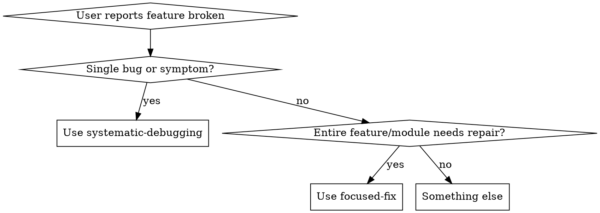
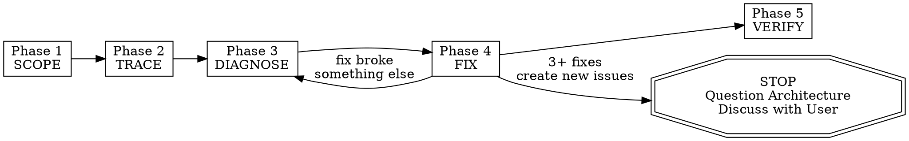

# focused-fix

Source: Claude skill
Original path: `components/claude-skills/engineering/skills/focused-fix/SKILL.md`
Description: Use when the user asks to fix, debug, or make a specific feature/module/area work end-to-end. Triggers: 'make X work', 'fix the Y feature', 'the Z module is broken', 'focus on [area]'. Not for quick single-bug fixes — this is for systematic deep-dive repair across all files and dependencies.

## How to use in non-Claude agents

Use this guidance when the user request matches the description. Prefer local project conventions over Claude-specific mechanics.

## Portable guidance

# Focused Fix — Deep-Dive Feature Repair

## When to Use

Activate when the user asks to fix, debug, or make a specific feature/module/area work. Key triggers:
- "make X work"
- "fix the Y feature"
- "the Z module is broken"
- "focus on [area]"
- "this feature needs to work properly"

This is NOT for quick single-bug fixes (use systematic-debugging for that). This is for when an entire feature or module needs systematic repair — tracing every dependency, reading logs, checking tests, mapping the full dependency graph.



## The Iron Law

```
NO FIXES WITHOUT COMPLETING SCOPE → TRACE → DIAGNOSE FIRST
```

If you haven't finished Phase 3, you cannot propose fixes. Period.

**Violating the letter of these phases is violating the spirit of focused repair.**

## Protocol — STRICTLY follow these 5 phases IN ORDER



### Phase 1: SCOPE — Map the Feature Boundary

Before touching any code, understand the full scope of the feature.

1. Ask the user: "Which feature/folder should I focus on?" if not already clear
2. Identify the PRIMARY folder/files for this feature
3. Map EVERY file in that folder — read each one, understand its purpose
4. Create a feature manifest:

```
FEATURE SCOPE:
  Primary path: src/features/auth/
  Entry points: [files that are imported by other parts of the app]
  Internal files: [files only used within this feature]
  Total files: N
  Total lines: N
```

### Phase 2: TRACE — Map All Dependencies (Inside AND Outside)

Trace every connection this feature has to the rest of the codebase.

**INBOUND (what this feature imports):**
1. For every import statement in every file in the feature folder:
   - Trace it to its source
   - Verify the source file exists
   - Verify the imported entity (function, type, component) exists and is exported
   - Check if the types/signatures match what the feature expects
2. Check for:
   - Environment variables used (grep for process.env, import.meta.env, os.environ, etc.)
   - Config files referenced
   - Database models/schemas used
   - API endpoints called
   - Third-party packages imported

**OUTBOUND (what imports this feature):**
1. Search the entire codebase for imports from this feature folder
2. For each consumer:
   - Verify they're importing entities that actually exist
   - Check if they're using the correct API/interface
   - Note if any consumers are using deprecated patterns

Output format:
```
DEPENDENCY MAP:
  Inbound (this feature depends on):
    src/lib/db.ts → used in auth/repository.ts (getUserById, createUser)
    src/lib/jwt.ts → used in auth/service.ts (signToken, verifyToken)
    @prisma/client → used in auth/repository.ts
    process.env.JWT_SECRET → used in auth/service.ts
    process.env.DATABASE_URL → used via prisma

  Outbound (depends on this feature):
    src/app/api/login/route.ts → imports { login } from auth/service
    src/app/api/register/route.ts → imports { register } from auth/service
    src/middleware.ts → imports { verifyToken } from auth/service

  Env vars required: JWT_SECRET, DATABASE_URL
  Config files: prisma/schema.prisma (User model)
```

### Phase 3: DIAGNOSE — Find Every Issue

Systematically check for problems. Run ALL of these checks:

**CODE QUALITY:**
- [ ] Every import resolves to a real file/export
- [ ] No circular dependencies within the feature
- [ ] Types are consistent across boundaries (no `any` at interfaces)
- [ ] Error handling exists for all async operations
- [ ] No TODO/FIXME/HACK comments indicating known issues

**RUNTIME:**
- [ ] All required environment variables are set (check .env)
- [ ] Database migrations are up to date (if applicable)
- [ ] API endpoints return expected shapes
- [ ] No hardcoded values that should be configurable

**TESTS:**
- [ ] Run ALL tests related to this feature: find them by searching for imports from the feature folder
- [ ] Record every failure with full error output
- [ ] Check test coverage — are there untested code paths?

**LOGS & ERRORS:**
- [ ] Search for any log files, error reports, or Sentry-style error tracking
- [ ] Check git log for recent changes to this feature: `git log --oneline -20 -- <feature-path>`
- [ ] Check if any recent commits might have broken something: `git log --oneline -5 --all -- <files that this feature depends on>`

**CONFIGURATION:**
- [ ] Verify all config files this feature depends on are valid
- [ ] Check for mismatches between development and production configs
- [ ] Verify third-party service credentials are valid (if testable)

**ROOT-CAUSE CONFIRMATION:**
For each CRITICAL issue found, confirm root cause before adding it to the fix list:
- State clearly: "I think X is the root cause because Y"
- Trace the data/control flow backward to verify — don't trust surface-level symptoms
- If the issue spans multiple components, add diagnostic logging at each boundary to identify which layer fails
- **REQUIRED SUB-SKILL:** For complex bugs found during diagnosis, apply `superpowers:systematic-debugging` Phase 1 (Root Cause Investigation) to confirm before proceeding

**RISK LABELING:**
Assign each issue a risk label:

| Risk | Criteria |
|---|---|
| HIGH | Public API surface / breaking interface contract / DB schema / auth or security logic / widely imported module (>3 callers) / git hotspot |
| MED | Internal module with tests / shared utility / config with runtime impact / internal callers of changed functions |
| LOW | Leaf module / isolated file / test-only change / single-purpose helper with no callers |

Output format:
```
DIAGNOSIS REPORT:
  Issues found: N

  CRITICAL:
    1. [HIGH] [file:line] — description of issue. Root cause: [confirmed explanation]
    2. [HIGH] [file:line] — description of issue. Root cause: [confirmed explanation]

  WARNINGS:
    1. [MED] [file:line] — descr

...[truncated for portable export]

## Limits

Claude-only slash commands, hooks, or tool names may need manual adaptation for this target tool.
