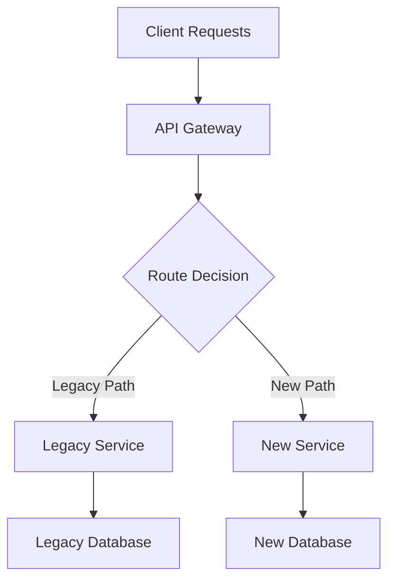

# migration-architect

Source: Claude skill
Original path: `components/claude-skills/engineering/skills/migration-architect/SKILL.md`
Description: Zero-downtime migration planning, compatibility validation, and rollback strategy generation. Tools for system, database, and infrastructure migrations with minimal business impact. Use when planning a database migration, infrastructure cutover, system replacement, or any high-risk transition that needs explicit rollback paths.

## How to use in non-Claude agents

Use this guidance when the user request matches the description. Prefer local project conventions over Claude-specific mechanics.

## Portable guidance

# Migration Architect

**Tier:** POWERFUL  
**Category:** Engineering - Migration Strategy  
**Purpose:** Zero-downtime migration planning, compatibility validation, and rollback strategy generation

## Overview

The Migration Architect skill provides comprehensive tools and methodologies for planning, executing, and validating complex system migrations with minimal business impact. This skill combines proven migration patterns with automated planning tools to ensure successful transitions between systems, databases, and infrastructure.

## Core Capabilities

### 1. Migration Strategy Planning
- **Phased Migration Planning:** Break complex migrations into manageable phases with clear validation gates
- **Risk Assessment:** Identify potential failure points and mitigation strategies before execution
- **Timeline Estimation:** Generate realistic timelines based on migration complexity and resource constraints
- **Stakeholder Communication:** Create communication templates and progress dashboards

### 2. Compatibility Analysis
- **Schema Evolution:** Analyze database schema changes for backward compatibility issues
- **API Versioning:** Detect breaking changes in REST/GraphQL APIs and microservice interfaces
- **Data Type Validation:** Identify data format mismatches and conversion requirements
- **Constraint Analysis:** Validate referential integrity and business rule changes

### 3. Rollback Strategy Generation
- **Automated Rollback Plans:** Generate comprehensive rollback procedures for each migration phase
- **Data Recovery Scripts:** Create point-in-time data restoration procedures
- **Service Rollback:** Plan service version rollbacks with traffic management
- **Validation Checkpoints:** Define success criteria and rollback triggers

## Migration Patterns

### Database Migrations

#### Schema Evolution Patterns
1. **Expand-Contract Pattern**
   - **Expand:** Add new columns/tables alongside existing schema
   - **Dual Write:** Application writes to both old and new schema
   - **Migration:** Backfill historical data to new schema
   - **Contract:** Remove old columns/tables after validation

2. **Parallel Schema Pattern**
   - Run new schema in parallel with existing schema
   - Use feature flags to route traffic between schemas
   - Validate data consistency between parallel systems
   - Cutover when confidence is high

3. **Event Sourcing Migration**
   - Capture all changes as events during migration window
   - Apply events to new schema for consistency
   - Enable replay capability for rollback scenarios

#### Data Migration Strategies
1. **Bulk Data Migration**
   - **Snapshot Approach:** Full data copy during maintenance window
   - **Incremental Sync:** Continuous data synchronization with change tracking
   - **Stream Processing:** Real-time data transformation pipelines

2. **Dual-Write Pattern**
   - Write to both source and target systems during migration
   - Implement compensation patterns for write failures
   - Use distributed transactions where consistency is critical

3. **Change Data Capture (CDC)**
   - Stream database changes to target system
   - Maintain eventual consistency during migration
   - Enable zero-downtime migrations for large datasets

### Service Migrations

#### Strangler Fig Pattern
1. **Intercept Requests:** Route traffic through proxy/gateway
2. **Gradually Replace:** Implement new service functionality incrementally
3. **Legacy Retirement:** Remove old service components as new ones prove stable
4. **Monitoring:** Track performance and error rates throughout transition



#### Parallel Run Pattern
1. **Dual Execution:** Run both old and new services simultaneously
2. **Shadow Traffic:** Route production traffic to both systems
3. **Result Comparison:** Compare outputs to validate correctness
4. **Gradual Cutover:** Shift traffic percentage based on confidence

#### Canary Deployment Pattern
1. **Limited Rollout:** Deploy new service to small percentage of users
2. **Monitoring:** Track key metrics (latency, errors, business KPIs)
3. **Gradual Increase:** Increase traffic percentage as confidence grows
4. **Full Rollout:** Complete migration once validation passes

### Infrastructure Migrations

#### Cloud-to-Cloud Migration
1. **Assessment Phase**
   - Inventory existing resources and dependencies
   - Map services to target cloud equivalents
   - Identify vendor-specific features requiring refactoring

2. **Pilot Migration**
   - Migrate non-critical workloads first
   - Validate performance and cost models
   - Refine migration procedures

3. **Production Migration**
   - Use infrastructure as code for consistency
   - Implement cross-cloud networking during transition
   - Maintain disaster recovery capabilities

#### On-Premises to Cloud Migration
1. **Lift and Shift**
   - Minimal changes to existing applications
   - Quick migration with optimization later
   - Use cloud migration tools and services

2. **Re-architecture**
   - Redesign applications for cloud-native patterns
   - Adopt microservices, containers, and serverless
   - Implement cloud security and scaling practices

3. **Hybrid Approach**
   - Keep sensitive data on-premises
   - Migrate compute workloads to cloud
   - Implement secure connectivity between environments

## Feature Flags for Migrations

### Progressive Feature Rollout
```python
# Example feature flag implementation
class MigrationFeatureFlag:
    def __init__(self, flag_name, rollout_percentage=0):
        self.flag_name = flag_name
        self.rollout_percentage = rollout_percentage
    
    def is_enabled_for_user(self, user_id):
        hash_value = hash(f"{self.flag_name}:{user_id}")
        return (hash_value % 100) < self.rollout_percentage
    
    def gradual_rollout(self, target_percentage, step_size=10):
        while self.rollout_percentage < target_percentage:
            self.rollout_percentage = min(
                self.rollout_percentage + step_size,
                target_percentage
            )
            yield self.rollout_percentage
```

### Circuit Breaker Pattern
Implement automatic fallback to legacy systems when new systems show degraded performance:

```python
class MigrationCircuitBreaker:
    def __init__(self, failure_threshold=5, timeout=60):
        self.failure_count = 0
        self.failure_threshold = failure_threshold
        self.timeout = timeout
        self.last_failure_time = None
        self.state = 'CLOSED'  # CLOSED, OPEN, HALF_OPEN
    
    def call_new_service(self, request):
        if self.state == 'OPEN':
            if self.should_attempt_reset():
                self.state = 'HALF_OPEN'
            else:
                return self.fallback_to_legacy(request)
        
        try:
            response = self.new_servi

...[truncated for portable export]

## Limits

Claude-only slash commands, hooks, or tool names may need manual adaptation for this target tool.
